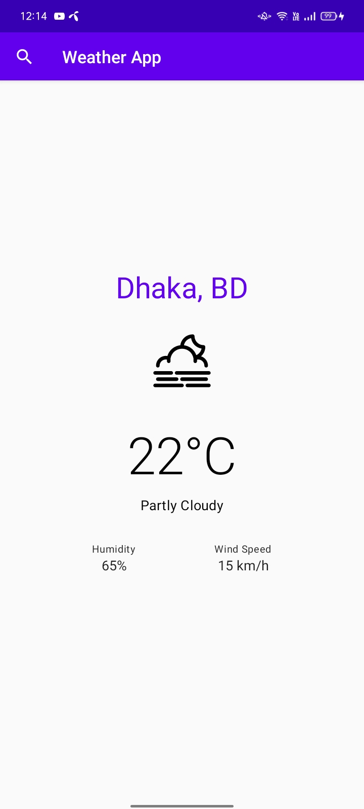

# Simple Jetpack Compose Navigation Example


## Requirements
- Android Studio Flamingo or later

## Tech Stack
- Jetpack Compose
- Navigation Compose
- Compose Destination
- Clean Architecture
- Ktor
- Koin DI

## Articles
- [Open Api Weather](https://openweathermap.org/api)
- [Clean Architecture](https://medium.com/@sazib/android-mvvm-with-clean-code-dda2bf78bb64)
- [Json from Asset](https://medium.com/@sazib/read-json-file-from-assets-346f624faf92)
- [Koin DI](https://insert-koin.io/)
- [KTOR](https://ktor.io/)

## Branches
- [master](https://github.com/sazibislam/tenmin) - Basic Compose Navigation

## License
```
Copyright 2024 Saiful Sazib

Licensed under the Apache License, Version 2.0 (the "License");

you may not use this file except in compliance with the License.
You may obtain a copy of the License at

http://www.apache.org/licenses/LICENSE-2.0

Unless required by applicable law or agreed to in writing, software
distributed under the License is distributed on an "AS IS" BASIS,
WITHOUT WARRANTIES OR CONDITIONS OF ANY KIND, either express or implied.
See the License for the specific language governing permissions and
limitations under the License.
```
