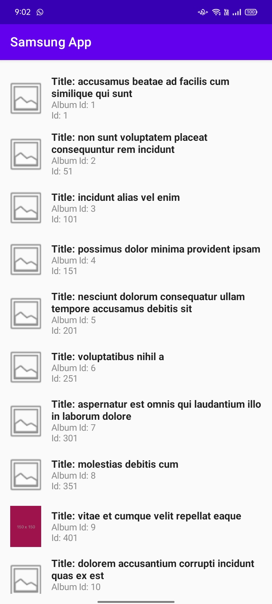

# Jetpack Compose Navigation Example



## Requirements
- Android Studio Koala or Higher

## Tech Stack
- Jetpack Compose
- Navigation Compose
- Compose Destination
- Clean Architecture
- Ktor
- Koin DI
- Coil - Image loading library
- Mockito
- Espresso

## Features:
- Samsung App Home:
    - Displays a list of album.
    - A list of photos, with the title of the photo, the photo as a thumbnail, the album name
    - In the list, only show the first photo of each album.

## Development Guidelines:
 # Architecture:

    Use Clean Architecture with layers:
    Data Layer: Handles API and JSON.
    Domain Layer: Business logic (weather fetching).
    Presentation Layer: UI with Jetpack Compose.
    Dependency Injection:

    Use Koin for dependency management (e.g., ViewModel, HttpClient).
# UI Framework:

    Leverage Jetpack Compose with Material Design.
    Implement dynamic lists (e.g., LazyColumn).
# Navigation:

    Use Compose Navigation for screen transitions:
    Home Screen → Search Screen → Back to Home Screen with updated data.

# Implementation:
    Data Layer: Fetch data of album Using https://jsonplaceholder.typicode.com/ api
    UI: Display a list of album.
    State Management: Use ViewModel to manage UI state and Album data.

## Articles
- [Dummy Album Data](https://jsonplaceholder.typicode.com/)
- [Clean Architecture](https://medium.com/@sazib/android-mvvm-with-clean-code-dda2bf78bb64)
- [Json from Asset](https://medium.com/@sazib/read-json-file-from-assets-346f624faf92)
- [Koin DI](https://insert-koin.io/)
- [KTOR](https://ktor.io/)

## Branches
- [master](https://github.com/sazibislam/tenmin) - Basic Compose Navigation
- [samsung](https://github.com/sazibislam/tenmin/tree/Samsung) - Test Case with a list of album
- [medium](https://medium.com/@sazib/jetpack-compose-navigation-c6e43e08ffdc) - Basic Compose Navigation

## License
```
Copyright 2024 Saiful Sazib

Licensed under the Apache License, Version 2.0 (the "License");

you may not use this file except in compliance with the License.
You may obtain a copy of the License at

http://www.apache.org/licenses/LICENSE-2.0

Unless required by applicable law or agreed to in writing, software
distributed under the License is distributed on an "AS IS" BASIS,
WITHOUT WARRANTIES OR CONDITIONS OF ANY KIND, either express or implied.
See the License for the specific language governing permissions and
limitations under the License.
```
